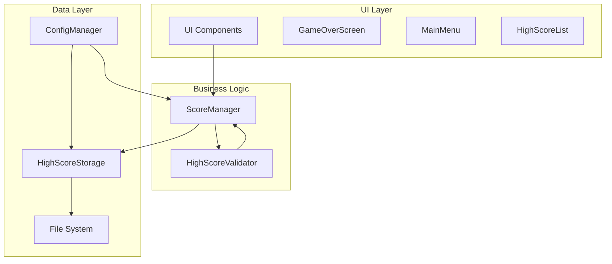

# Design Document

## Overview

The high score save system enhances the existing ScoreManager with robust data persistence, validation, and user experience improvements. The design builds upon Godot's FileAccess system already used in the current implementation while adding comprehensive error handling, data validation, and configuration management.

The system follows a layered architecture where the enhanced ScoreManager handles business logic, a new HighScoreStorage class manages file operations, and UI components provide user interaction. This separation ensures maintainability and testability while integrating seamlessly with the existing game architecture.

## Architecture

### System Components



### Data Flow

1. **Score Achievement**: Player achieves high score → ScoreManager validates → HighScoreStorage persists
2. **Game Startup**: Game loads → HighScoreStorage reads file → ScoreManager initializes with data
3. **Name Entry**: Player enters name → UI validates → ScoreManager updates → Storage saves
4. **Display**: UI requests scores → ScoreManager provides formatted data → UI displays

## Components and Interfaces

### Enhanced ScoreManager

**Responsibilities:**
- Manage high score business logic
- Coordinate between storage and UI
- Handle score validation and formatting
- Emit events for UI updates

**New Methods:**
```gdscript
# Configuration and initialization
func initialize_with_config(config: Dictionary)
func set_max_high_scores(count: int)

# Enhanced score management
func submit_high_score(player_index: int, player_name: String) -> HighScoreResult
func get_formatted_high_scores() -> Array[Dictionary]
func is_qualifying_score(score: int) -> bool
func get_player_rank(score: int) -> int

# Validation and error handling
func validate_player_name(name: String) -> String
func handle_save_error(error: Error)

# Events and feedback
signal high_score_saved(player_name: String, score: int, rank: int)
signal save_error(error_message: String)
signal personal_best_achieved(player_index: int, previous_best: int)
```

### HighScoreStorage Class

**Responsibilities:**
- Handle all file I/O operations
- Manage data serialization/deserialization
- Implement backup and recovery mechanisms
- Provide error handling for storage operations

**Interface:**
```gdscript
class_name HighScoreStorage

# Core operations
func save_high_scores(scores: Array[Dictionary]) -> Error
func load_high_scores() -> Array[Dictionary]
func backup_high_scores() -> Error
func restore_from_backup() -> Array[Dictionary]

# File management
func get_save_file_path() -> String
func get_backup_file_path() -> String
func verify_file_integrity(file_path: String) -> bool
func migrate_old_format(old_data: Dictionary) -> Array[Dictionary]

# Configuration
func set_save_location(path: String)
func set_backup_enabled(enabled: bool)
```

### HighScoreValidator Class

**Responsibilities:**
- Validate score data integrity
- Sanitize player names
- Detect impossible or suspicious scores
- Provide data validation utilities

**Interface:**
```gdscript
class_name HighScoreValidator

# Score validation
func is_valid_score(score: int) -> bool
func is_reasonable_score(score: int, game_duration: float) -> bool
func sanitize_player_name(name: String) -> String

# Data integrity
func validate_high_score_entry(entry: Dictionary) -> ValidationResult
func validate_high_score_list(scores: Array[Dictionary]) -> ValidationResult

# Constants
const MAX_PLAYER_NAME_LENGTH = 20
const MIN_SCORE = 0
const MAX_REASONABLE_SCORE = 99_999_999
```

### ConfigManager Integration

**Responsibilities:**
- Manage system configuration
- Provide default values
- Handle configuration file loading

**Configuration Options:**
```gdscript
# Default configuration
var default_config = {
    "max_high_scores": 10,
    "save_location": "user://high_scores.save",
    "backup_enabled": true,
    "auto_save": true,
    "validation_strict": false,
    "debug_logging": false
}
```

## Data Models

### HighScoreEntry Structure

```gdscript
# Enhanced high score entry
{
    "name": String,           # Player name (max 20 chars)
    "score": int,            # Score value
    "date": String,          # ISO date string (YYYY-MM-DD)
    "timestamp": int,        # Unix timestamp
    "player_index": int,     # Which player achieved this (1-4)
    "session_id": String,    # Unique session identifier
    "version": String        # Game version when achieved
}
```

### ValidationResult Structure

```gdscript
# Validation result object
{
    "valid": bool,           # Whether validation passed
    "errors": Array[String], # List of validation errors
    "warnings": Array[String], # List of warnings
    "sanitized_data": Dictionary # Cleaned/corrected data
}
```

### HighScoreResult Structure

```gdscript
# Result of high score submission
{
    "success": bool,         # Whether submission succeeded
    "rank": int,            # Final rank in high score list
    "is_personal_best": bool, # Whether this is a new personal best
    "previous_score": int,   # Previous score if updating existing entry
    "message": String       # User-friendly result message
}
```

## Error Handling

### Error Categories

1. **File System Errors**
   - Insufficient disk space
   - Permission denied
   - File corruption
   - Path not found

2. **Data Validation Errors**
   - Invalid score values
   - Malformed player names
   - Corrupted save data
   - Version incompatibility

3. **Configuration Errors**
   - Missing config file
   - Invalid config values
   - Migration failures

### Error Recovery Strategies

```gdscript
# Error handling workflow
func handle_storage_error(error: Error) -> void:
    match error:
        ERR_FILE_CANT_WRITE:
            # Try backup location, then disable auto-save
            attempt_backup_save()
        ERR_FILE_CORRUPT:
            # Restore from backup, then recreate if needed
            restore_from_backup_or_reset()
        ERR_OUT_OF_MEMORY:
            # Reduce high score list size temporarily
            reduce_high_score_count()
        _:
            # Log error and continue with in-memory scores
            log_error_and_continue(error)
```

### Backup and Recovery

- **Automatic Backup**: Create backup before each save operation
- **Corruption Detection**: Verify file integrity on load
- **Recovery Process**: Attempt backup restore, then graceful degradation
- **Migration Support**: Handle old save file formats

## Testing Strategy

### Unit Tests

1. **HighScoreStorage Tests**
   - File save/load operations
   - Backup and recovery mechanisms
   - Error handling scenarios
   - Data migration

2. **HighScoreValidator Tests**
   - Score validation edge cases
   - Name sanitization
   - Data integrity checks
   - Performance with large datasets

3. **ScoreManager Integration Tests**
   - Score submission workflow
   - Multi-player scenarios
   - Configuration changes
   - Event emission

### Integration Tests

1. **File System Integration**
   - Cross-platform file operations
   - Permission handling
   - Disk space scenarios
   - Concurrent access

2. **UI Integration**
   - High score display
   - Name entry validation
   - Error message display
   - Animation and feedback

### Performance Tests

1. **Large Dataset Handling**
   - Loading 1000+ high scores
   - Frequent save operations
   - Memory usage optimization
   - Startup time impact

2. **Error Scenario Performance**
   - Recovery time from corruption
   - Backup creation speed
   - Validation performance

### Manual Testing Scenarios

1. **User Experience Testing**
   - High score achievement flow
   - Name entry experience
   - Error message clarity
   - Visual feedback timing

2. **Edge Case Testing**
   - Disk full scenarios
   - File permission changes
   - System clock changes
   - Game version updates

### Test Data Management

- **Mock Data Generation**: Create realistic test high score data
- **Corruption Simulation**: Intentionally corrupt save files for testing
- **Performance Benchmarks**: Establish baseline performance metrics
- **Cross-Platform Validation**: Test on Windows, Mac, and Linux

The testing strategy ensures robust operation across all supported platforms and graceful handling of edge cases that could occur in real-world usage.