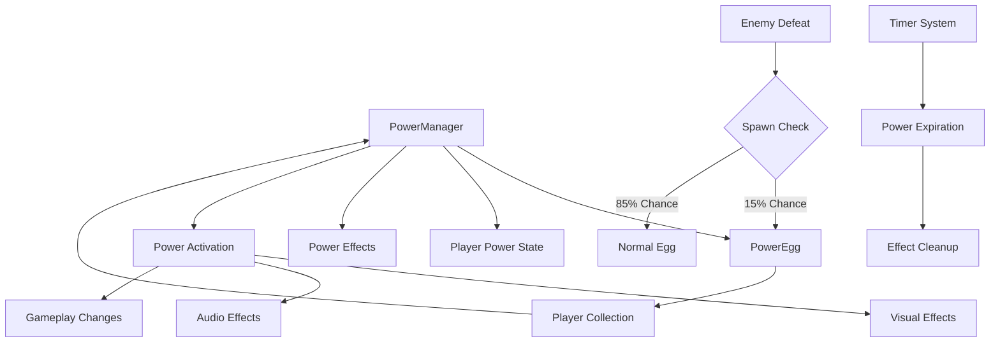

# Power-Up System Design Document

## Overview

The Power-Up System adds temporary special abilities to players through collectible power eggs that spawn instead of normal eggs when enemies are defeated. This system enhances gameplay by providing strategic advantages and exciting moments of enhanced player capability while maintaining the core Joust mechanics.

## Architecture

### System Components



### Core Architecture Principles

1. **Minimal Disruption**: Power eggs replace normal eggs rather than adding complexity
2. **Modular Design**: Each power type is self-contained and easily extensible
3. **State Management**: Clear separation between power activation, duration, and deactivation
4. **Multi-Player Support**: Independent power tracking per player
5. **Configuration-Driven**: All parameters externally configurable for balancing

## Components and Interfaces

### PowerManager Class

**Location**: `scripts/managers/power_manager.gd`

```gdscript
class_name PowerManager
extends Node

# Power type enumeration
enum PowerType {
    NONE = -1,
    INVINCIBILITY = 0
}

# Power state data structure
class PowerData:
    var type: PowerType
    var start_time: float
    var duration: float
    var player_index: int
    
    func is_expired() -> bool:
        return Time.get_time_dict_from_system().unix >= start_time + duration
    
    func get_remaining_time() -> float:
        var current_time = Time.get_time_dict_from_system().unix
        return max(0.0, (start_time + duration) - current_time)

# Configuration system
var power_configs: Dictionary = {
    PowerType.INVINCIBILITY: {
        "duration": 10.0,
        "spawn_chance": 0.15,
        "enemy_spawn_rates": {
            "EnemyBase": 0.15,
            "EnemyHunter": 0.20,
            "ShadowLord": 0.25
        },
        "effects": {
            "player_glow": true,
            "screen_tint": Color(0.8, 0.8, 1.0, 0.3),
            "particle_effect": "invincibility_sparkles"
        },
        "audio": {
            "collection": "power_collect_invincibility",
            "activation": "invincibility_start",
            "ambient": "invincibility_loop",
            "warning": "power_expire_warning",
            "expiration": "power_expire"
        }
    }
}

# Active powers tracking
var active_powers: Dictionary = {}  # player_index -> PowerData
var power_timers: Dictionary = {}   # player_index -> Timer

# Signals
signal power_collected(player_index: int, power_type: PowerType)
signal power_activated(player_index: int, power_type: PowerType, duration: float)
signal power_expired(player_index: int, power_type: PowerType)
signal power_warning(player_index: int, power_type: PowerType, remaining_time: float)

# Public Interface
func should_spawn_power_egg(enemy_class_name: String) -> bool
func get_power_egg_scene() -> PackedScene
func activate_power(player_index: int, power_type: PowerType) -> bool
func deactivate_power(player_index: int) -> void
func is_power_active(player_index: int, power_type: PowerType = PowerType.NONE) -> bool
func get_active_power_type(player_index: int) -> PowerType
func get_remaining_duration(player_index: int) -> float
func update_power_timers(delta: float) -> void
```

### PowerEgg Class

**Location**: `scripts/entities/power_egg.gd`

```gdscript
class_name PowerEgg
extends RigidBody2D

# Power egg properties
@export var power_type: PowerManager.PowerType = PowerManager.PowerType.INVINCIBILITY
@export var collection_points: int = 200
@export var timeout_duration: float = 15.0

# Visual components
@onready var sprite: AnimatedSprite2D = $AnimatedSprite2D
@onready var glow_effect: AnimatedSprite2D = $GlowEffect
@onready var collection_area: Area2D = $CollectionArea
@onready var spawn_effect: GPUParticles2D = $SpawnEffect
@onready var timeout_timer: Timer = $TimeoutTimer

# Audio components
@onready var spawn_sound: AudioStreamPlayer2D = $SpawnSound
@onready var collection_sound: AudioStreamPlayer2D = $CollectionSound

# State tracking
var is_collected: bool = false
var spawn_time: float

func _ready():
    _setup_visual_appearance()
    _setup_physics_properties()
    _setup_collection_detection()
    _start_timeout_timer()
    _play_spawn_effects()

func _setup_visual_appearance():
    # Set power-specific visual properties
    match power_type:
        PowerManager.PowerType.INVINCIBILITY:
            sprite.modulate = Color(1.0, 0.8, 0.3)  # Golden color
            glow_effect.play("invincibility_glow")

func collect(player_index: int):
    if is_collected:
        return
    
    is_collected = true
    _play_collection_effects()
    _award_points(player_index)
    _activate_power(player_index)
    _cleanup()

func _activate_power(player_index: int):
    var power_manager = get_node("/root/PowerManager")
    if power_manager:
        power_manager.activate_power(player_index, power_type)

func _on_timeout():
    if not is_collected:
        _cleanup()
```

### Player Power Integration

**Modifications to**: `scripts/entities/player.gd`

```gdscript
# Add power state variables
var active_power_type: PowerManager.PowerType = PowerManager.PowerType.NONE
var is_power_active: bool = false

# Visual effect components
@onready var power_overlay: AnimatedSprite2D = $PowerOverlay
@onready var power_particles: GPUParticles2D = $PowerParticles
@onready var power_audio: AudioStreamPlayer2D = $PowerAudio

# Power activation method
func activate_power(power_type: PowerManager.PowerType, duration: float):
    # Deactivate any existing power
    if is_power_active:
        deactivate_power()
    
    active_power_type = power_type
    is_power_active = true
    
    # Apply power-specific effects
    match power_type:
        PowerManager.PowerType.INVINCIBILITY:
            _activate_invincibility()
    
    # Start visual and audio effects
    _start_power_effects(power_type)

func _activate_invincibility():
    # Modify collision behavior
    set_collision_mask_value(3, false)  # Don't collide with enemies
    
    # Enable enemy defeat on contact
    if combat_area:
        combat_area.monitoring = true
        combat_area.connect("area_entered", _on_invincibility_contact)

func _on_invincibility_contact(area: Area2D):
    if area.is_in_group("enemy_vulnerable_areas"):
        var enemy = area.get_parent()
        if enemy and enemy.has_method("defeat"):
            enemy.defeat(velocity, player_index, true)
            # Add bonus score for invincibility kills
            ScoreManager.add_bonus_score(player_index, 150, "Invincibility Kill", enemy.global_position)

func deactivate_power():
    if not is_power_active:
        return
    
    match active_power_type:
        PowerManager.PowerType.INVINCIBILITY:
            _deactivate_invincibility()
    
    _stop_power_effects()
    active_power_type = PowerManager.PowerType.NONE
    is_power_active = false

func _deactivate_invincibility():
    # Restore normal collision behavior
    set_collision_mask_value(3, true)  # Re-enable enemy collision
    
    # Disable invincibility contact detection
    if combat_area and combat_area.is_connected("area_entered", _on_invincibility_contact):
        combat_area.disconnect("area_entered", _on_invincibility_contact)
```

### Enemy Integration

**Modifications to**: `scripts/entities/enemy_base.gd`

```gdscript
func defeat(player_velocity: Vector2 = Vector2.ZERO, player_index: int = 1, award_score: bool = true):
    # ... existing defeat validation logic ...
    
    # NEW: Determine egg type to spawn
    var power_manager = get_node("/root/PowerManager")
    var should_spawn_power = false
    
    if power_manager:
        should_spawn_power = power_manager.should_spawn_power_egg(get_script().get_path().get_file().get_basename())
    
    if should_spawn_power:
        _spawn_power_egg(player_velocity)
    else:
        _spawn_normal_egg(player_velocity)
    
    # ... rest of existing defeat logic ...

func _spawn_power_egg(player_velocity: Vector2):
    # Create power egg instead of normal egg
    var power_manager = get_node("/root/PowerManager")
    var power_egg_scene = power_manager.get_power_egg_scene()
    var power_egg = power_egg_scene.instantiate()
    
    # Set position and physics
    power_egg.global_position = global_position
    power_egg.linear_velocity = _calculate_egg_velocity(player_velocity)
    
    # Add to scene
    get_parent().add_child(power_egg)
    
    # Hide this enemy's egg components
    if egg_sprite:
        egg_sprite.visible = false
    if egg_area:
        egg_area.monitoring = false
        egg_area.monitorable = false
    
    # Transition to DEAD state immediately
    current_state = State.DEAD
    queue_free()

func _spawn_normal_egg(player_velocity: Vector2):
    # Existing egg spawning logic (extracted from defeat method)
    current_state = State.EGG
    # ... existing egg setup code ...
```

## Data Models

### Power Configuration Schema

```gdscript
# Power configuration structure
var power_config_schema = {
    "duration": 10.0,                    # Power duration in seconds
    "spawn_chance": 0.15,                # Base spawn probability (0.0-1.0)
    "enemy_spawn_rates": {               # Per-enemy type spawn rates
        "EnemyBase": 0.15,
        "EnemyHunter": 0.20,
        "ShadowLord": 0.25
    },
    "effects": {                         # Visual effect configuration
        "player_glow": true,
        "screen_tint": Color(0.8, 0.8, 1.0, 0.3),
        "particle_effect": "invincibility_sparkles",
        "overlay_animation": "invincibility_overlay"
    },
    "audio": {                          # Audio configuration
        "collection": "power_collect_invincibility",
        "activation": "invincibility_start",
        "ambient": "invincibility_loop",
        "warning": "power_expire_warning",
        "expiration": "power_expire"
    },
    "gameplay": {                       # Gameplay modification parameters
        "invulnerable": true,
        "defeat_on_contact": true,
        "bonus_score_multiplier": 1.5,
        "movement_speed_multiplier": 1.0
    }
}
```

### Power State Data Model

```gdscript
# Runtime power state tracking
class PowerState:
    var player_index: int
    var power_type: PowerManager.PowerType
    var activation_time: float
    var duration: float
    var warning_sent: bool = false
    
    func get_progress() -> float:
        var elapsed = Time.get_time_dict_from_system().unix - activation_time
        return elapsed / duration
    
    func get_remaining_time() -> float:
        var elapsed = Time.get_time_dict_from_system().unix - activation_time
        return max(0.0, duration - elapsed)
    
    func should_warn() -> bool:
        return not warning_sent and get_remaining_time() <= 3.0
    
    func is_expired() -> bool:
        return get_remaining_time() <= 0.0
```

## Error Handling

### Power System Error Scenarios

1. **Invalid Power Type**
   - **Scenario**: Attempting to activate non-existent power
   - **Handling**: Log error, ignore activation, continue normal gameplay
   - **Recovery**: No impact on game state

2. **Power Manager Not Available**
   - **Scenario**: PowerManager node not found in scene tree
   - **Handling**: Fall back to normal egg spawning, log warning
   - **Recovery**: Game continues without power-ups

3. **Player Not Found**
   - **Scenario**: Power activation called for invalid player index
   - **Handling**: Log error, ignore activation
   - **Recovery**: No impact on other players

4. **Resource Loading Failures**
   - **Scenario**: Power egg scene or audio files missing
   - **Handling**: Use fallback resources, log error
   - **Recovery**: Basic functionality maintained

5. **Timer System Failures**
   - **Scenario**: Power duration timer malfunction
   - **Handling**: Force power deactivation after maximum duration
   - **Recovery**: Prevent permanent power states

### Error Handling Implementation

```gdscript
# PowerManager error handling
func activate_power(player_index: int, power_type: PowerType) -> bool:
    # Validate inputs
    if player_index < 1 or player_index > 4:
        push_error("Invalid player index: %d" % player_index)
        return false
    
    if not power_configs.has(power_type):
        push_error("Unknown power type: %d" % power_type)
        return false
    
    # Get player reference safely
    var player = _get_player_safely(player_index)
    if not player:
        push_error("Player %d not found" % player_index)
        return false
    
    # Activate with error recovery
    try:
        _activate_power_internal(player, power_type)
        return true
    except:
        push_error("Failed to activate power %d for player %d" % [power_type, player_index])
        return false

func _get_player_safely(player_index: int) -> Node:
    var game_manager = get_node_or_null("/root/GameManager")
    if not game_manager:
        return null
    
    if player_index <= game_manager.player_nodes.size():
        return game_manager.player_nodes[player_index - 1]
    
    return null
```

## Testing Strategy

### Unit Testing Approach

#### PowerManager Tests
```gdscript
# Test power activation/deactivation
func test_power_activation():
    var power_manager = PowerManager.new()
    var result = power_manager.activate_power(1, PowerManager.PowerType.INVINCIBILITY)
    assert_true(result, "Power activation should succeed")
    assert_true(power_manager.is_power_active(1), "Power should be active")

# Test spawn probability
func test_spawn_probability():
    var power_manager = PowerManager.new()
    var spawn_count = 0
    var total_tests = 1000
    
    for i in total_tests:
        if power_manager.should_spawn_power_egg("EnemyBase"):
            spawn_count += 1
    
    var spawn_rate = float(spawn_count) / float(total_tests)
    assert_true(abs(spawn_rate - 0.15) < 0.05, "Spawn rate should be approximately 15%")

# Test power expiration
func test_power_expiration():
    var power_manager = PowerManager.new()
    power_manager.activate_power(1, PowerManager.PowerType.INVINCIBILITY)
    
    # Simulate time passage
    power_manager.active_powers[1].start_time -= 11.0  # Expire power
    power_manager.update_power_timers(0.1)
    
    assert_false(power_manager.is_power_active(1), "Power should expire after duration")
```

#### Player Integration Tests
```gdscript
# Test invincibility collision
func test_invincibility_collision():
    var player = preload("res://scenes/entities/player1.tscn").instantiate()
    var enemy = preload("res://scenes/entities/enemy_base.tscn").instantiate()
    
    player.activate_power(PowerManager.PowerType.INVINCIBILITY, 10.0)
    
    # Simulate collision
    player._on_invincibility_contact(enemy.vulnerable_area)
    
    assert_eq(enemy.current_state, enemy.State.EGG, "Enemy should be defeated on invincibility contact")
```

#### PowerEgg Tests
```gdscript
# Test power egg collection
func test_power_egg_collection():
    var power_egg = preload("res://scenes/entities/power_egg.tscn").instantiate()
    var initial_score = ScoreManager.get_score(1)
    
    power_egg.collect(1)
    
    assert_true(power_egg.is_collected, "Power egg should be marked as collected")
    assert_gt(ScoreManager.get_score(1), initial_score, "Score should increase after collection")
```

### Integration Testing

#### End-to-End Power Flow
1. **Enemy Defeat** → **Power Egg Spawn** → **Collection** → **Activation** → **Effect** → **Expiration**
2. **Multi-Player Independence**: Verify powers work independently for each player
3. **Power Replacement**: Ensure new power replaces existing one
4. **Audio/Visual Coordination**: Verify all feedback systems work together

### Performance Testing

#### Metrics to Monitor
- **Frame Rate Impact**: Power effects should not reduce FPS below 60
- **Memory Usage**: Power system should not cause memory leaks
- **Audio Performance**: Multiple power sounds should not cause audio stuttering
- **Particle System Load**: Visual effects should be optimized for multiple simultaneous powers

#### Performance Benchmarks
```gdscript
# Performance test for multiple active powers
func test_multiple_powers_performance():
    var start_time = Time.get_time_dict_from_system().unix
    
    # Activate powers for all 4 players
    for i in range(1, 5):
        PowerManager.activate_power(i, PowerManager.PowerType.INVINCIBILITY)
    
    # Simulate 60 frames of updates
    for frame in 60:
        PowerManager.update_power_timers(1.0/60.0)
    
    var end_time = Time.get_time_dict_from_system().unix
    var duration = end_time - start_time
    
    assert_lt(duration, 0.1, "Multiple power updates should complete quickly")
```

## Performance Considerations

### Optimization Strategies

1. **Lazy Evaluation**: Only process power effects when powers are active
2. **Object Pooling**: Reuse power egg instances and particle effects
3. **Efficient Collision Detection**: Optimize invincibility collision checks
4. **Audio Management**: Properly manage looping audio streams
5. **Visual Effect Culling**: Disable off-screen power effects

### Memory Management

1. **Automatic Cleanup**: Ensure all power effects are cleaned up on expiration
2. **Resource Preloading**: Load power-related resources at game start
3. **Weak References**: Use weak references where appropriate to prevent cycles
4. **Timer Management**: Properly clean up timer objects

### Scalability Considerations

1. **Multiple Power Types**: System designed to handle many different power types
2. **Player Count**: Efficient scaling for up to 4 simultaneous players
3. **Effect Stacking**: Prevent performance degradation from effect accumulation
4. **Configuration Flexibility**: Allow runtime adjustment of performance-critical parameters

This design provides a comprehensive foundation for implementing the power-up system while maintaining high performance and extensibility for future enhancements.